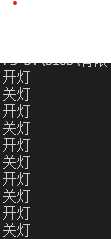

# 有限状态机

## 什么是有限状态机
有限状态机（Finite State Machine）是表示有限个状态（State）以及在这些状态（State）之间的转移（Transition）和动作（Action）等行为的数据模型。

* 状态 state: 当前系统的状况，且这种状况是有限的
* 事件 event：某一时刻出现的对系统状态进行变更的事情，促使系统从某一状态变成另一个状态，但状态不一定会变更，需要当前事件触发的条件满足你所设定的条件
* 转移 transition：状态变更，可能还会触发某些事件

## 用一个灯光的例子来演示一下
``` js
class LampStateMachine {
  constructor(initState) {
    this.state = initState;
  }
  changeState(state) {
    this.state = state;
  }
  clickEvent() {
    switch (this.state) {
      case 'on':
        this.changeState('off');
        // 触发关灯事件
        // doSomeThing();
        console.log('关灯')
        break;
      case 'off':
        this.changeState('on');
        // 触发开灯事件
        // doSomeThing();
        console.log('开灯');
        break;
    }
  }
}
```
执行一下
```js
const lampStateMachine = new LampStateMachine('off');
  for (let i = 0; i < 10; i++) {
    lampStateMachine.clickEvent();
  }
```
输出如下图：



## 再来一个更实际的例子，验证码

验证码倒计时的状态机，简单来说就只有两种状态，初始化和倒计时状态。当进入倒计时状态时，无论怎么触发事件，状态都是不会变更的，因为当前状态会需要在倒计时结束之后才会进入初始化，这个就是我们设立的条件。
*下面的例子有彩蛋（疑问）*
```js
class CaptchaMachine {
  constructor() {
    this.state = 'init';
  }
  clickEvent() {
    const _this = this;
    function countdown() {
      // console.log(this) 此时this的指向是？
      console.log('进入倒计时，倒计时60s');
      setTimeout(() => {
        _this.state = 'init';
      }, 1 * 1000); // 演示效果，调成1s
    }
    function _clickEvent() {
      switch (this.state) {
        case 'init':
          this.state = 'countDown';
          countdown();
          break;
        case 'countDown':
          console.log('nothing');
          break;
      }
    }
    this.clickEvent = _clickEvent;
    this.clickEvent();
  }
}

function captchaTest() {
  const captchaMachine = new CaptchaMachine();
  captchaMachine.clickEvent();

  captchaMachine.clickEvent(); // 并不会更改状态
  console.log('当前状态:', captchaMachine.state); // countDown
  
  captchaMachine.clickEvent(); // 并不会更改状态
  console.log('当前状态:', captchaMachine.state); // countDown

  captchaMachine.clickEvent(); // 并不会更改状态
  console.log('当前状态:', captchaMachine.state); // countDown

  captchaMachine.clickEvent(); // 并不会更改状态
  console.log('当前状态:', captchaMachine.state); // countDown
  setTimeout(() => {
    console.log('2s后的状态', captchaMachine.state);
  }, 2 * 1000); // 为了验证结果，调成2s
  console.log('状态检查结束', captchaMachine.state);
}
```

上面都是状态机的简单版（面对过程编程）展示

## 下面将是fsm的面对对象展示
[javascript-state-machine](https://github.com/jakesgordon/javascript-state-machine) 一个js写的有限状态机库

*以下例子都来源于javascript-state-machine*
```js
var fsm = new StateMachine({
    init: 'solid',
    transitions: [
      { name: 'melt',     from: 'solid',  to: 'liquid' },
      { name: 'freeze',   from: 'liquid', to: 'solid'  },
      { name: 'vaporize', from: 'liquid', to: 'gas'    },
      { name: 'condense', from: 'gas',    to: 'liquid' }
    ],
    methods: {
      onMelt:     function() { console.log('I melted')    },
      onFreeze:   function() { console.log('I froze')     },
      onVaporize: function() { console.log('I vaporized') },
      onCondense: function() { console.log('I condensed') }
    }
  });
```

可以通过`fsm.state` 查看当前状态
通过以下方法去改变状态机的当前状态
- fsm.melt
- fsm.freeze
- fsm.vaporize
- fsm.condense
还记得之前说的事件触发之后，状态不一定会变更。在这里的表示就是，状态机的状态是`solid`，此时调用`melt`方法，会将状态变更成`liquid`，但是如果是调用的是`freeze`方法的时候，就会报错，更多文档可以参考[javascript-state-machine](https://github.com/jakesgordon/javascript-state-machine)

## 关于彩蛋
```js
...
  clickEvent() {
    const _this = this;
    function countdown() {
      // console.log(this) 此时this的指向是？
      console.log('进入倒计时，倒计时60s');
      setTimeout(() => {
        // console.log(this) 此时this的指向是？
        _this.state = 'init';
      }, 1 * 1000); // 演示效果，调成1s
    }
    function _clickEvent() {
      switch (this.state) {
        case 'init':
          this.state = 'countDown';
          countdown();
          break;
        case 'countDown':
          console.log('nothing');
          break;
      }
    }
    this.clickEvent = _clickEvent;
    this.clickEvent();
  }
...
```
2处this的输出是undefined。
至于为什么。可以参考我下周会写的另一篇文章。